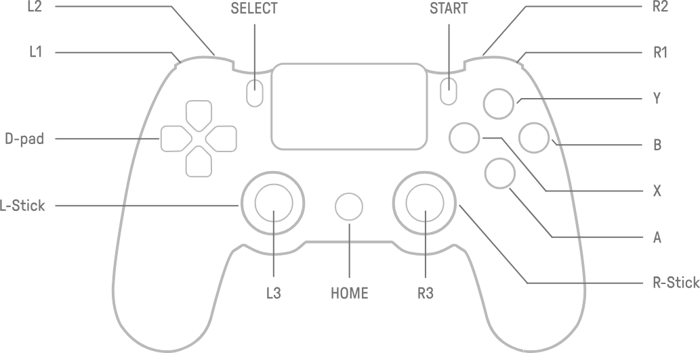
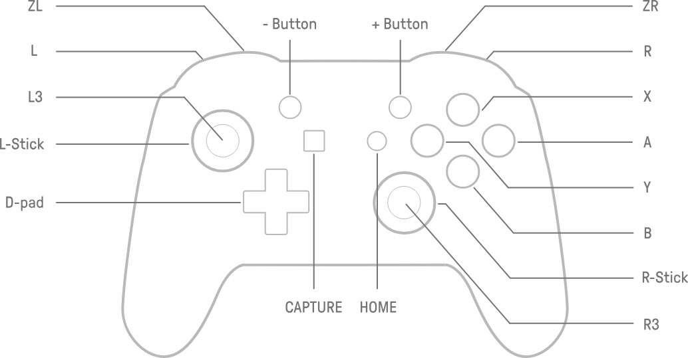

# 1. Overview
---
## 1.1. Introduction

### 1.1.1. Elevator Pitch

Inspired by classics of the golden age of Character Action - Project Polearm delivers a fast-paced stylish action experience with a Chinese flair. The heavenly realm of cultivators has been cursed by a evil being broken free of a sealing spell, and it’s young emperor’s physical body has been possessed by the demon lord. Use your skills in combat to style your way through hordes of beasts from Chinese mythology, decimate bigger-than-life bosses, free the heavens of evil’s curse and to resolve a long standing family feud. Your fate doesn’t lie in the hands of Heaven, but may it’s fate lie in yours?

### 1.1.2. Summary

The game is set in a fantasy realm of cultivators inspired by Chinese mythology and cultivation novels. The demon lord Chiyou (蚩尤) has broken free of a seal holding him in the deepest layers of hell and swears vengeance on humans. He corrupts the realm of the cultivators and possess the young emperor, preparing a full on demonic assault on the realms under the heaven. The player steps into the shoes of a man, soon revealed to be the uncle of the emperor, a former prince nonetheless, seeks to cleanse the realm of demon lord’s curse and clear his name tainted by a family feud. The player will encounter an array of enemies and grand bosses based on figures from Chinese mythology to hack and slash their way through. Along their way, the player will face the challenge of mastering the combat system of the game, from avoiding enemy attacks to chaining their moves into fluid, stylish combos. Along their way, the player will be able to amass a number of skills in the form of attacks, skills and spells to even further advance their combat prowess. All seems well, until suddenly, he encounters a mortal also on her way to the imperial palace. Both have the same goal in mind, but both have different reasons. Will they be able to work together to free the heavenly realm from the brink of chaos?

## 1.2. Game Concept

### 1.2.1. Genre & Style

This game is a **character action game** played from a **third-person perspective**, focusing on fast-paced and skilful combat, where the focus lies on giving actions a satisfying, cool looking and agile feel. This is intrinsically encouraged by the combo system, which contains special input chains, that when executed properly, will feel especially fluid due to each combo having unique animations and some having special effects at the end. The use of combos is also extrinsically motivated by the Flow-Meter, which calculates a ranking of the player’s current combat based on factors like the enemy chain count and number of unique combos executed in a row. Visually, the game resembles a **PS2-era graphical style**, with mid-poly models and texture work reminiscent of the Bishonen-style artwork found in the Metal Gear Solid, Devil May Cry and Genji games of that generation. The setting and designs in the game are inspired by **Chinese culture and mythology**, with environments, characters, and story elements being fictional but touched by traditional Chinese themes and legends, thereby inheriting their feel.

### 1.2.2. Inspiration & References

The game’s primary inspiration is the critically acclaimed character action game _Devil May Cry 3_, published by Capcom in 2005. We seek to not only imitate, but also innovate on the mechanics and the themes explored in this cult classic and milestone in the entire action game genre. Other inspirations include the original _God of War_ trilogy, _Bayonetta_ and _Odin Sphere_. We seek to lift combat mechanics and other elements of these games to create a more streamlined combat system, which remains just as deep below the surface as DMC3.

### 1.2.2. Target Audience

The game’s primary target audience are players who are interested in stylish action using deep and complex combat systems. The game’s setting combines a Chinese architectural style heavily influenced by the Ming dynasty with a story and world heavily inspired by Daoist and Buddhist elements from Chinese Wuxia and Cultivation novels, seeking to appeal to fans of Chinese culture, mythology and modern literature. With PS2-era graphics, it also resonates with older gamers nostalgic of the golden era of gaming, especially fans of action games in the early 2000s, as well as younger players drawn in by the intrigue of retro aesthetics.

### 1.2.3. Unique Selling Points

Character action games are a small niche within action games, with their golden age having long passed and with not many games being published every year. The game aspires not to compete with major franchises in popular genres, but to offer an increasingly rare pure-action experience with a shorter runtime but combat packed gameplay incentivising replayability.

The game stands out with its **Chinese-inspired setting and mythology**, offering a fresh take on the genre. With natural environments designed after Chinese ink paintings, buildings in a Ming-Dynasty architectural style, enemies inspired by stories from Chinese mythology and history and a bombastic rock & metal soundtrack performed on modern and classical Chinese instruments alike, we aspire to bring something new to the character action genre and reflect elements that are generally rare to encounter in gaming.

Visually, we have chosen to intentionally go a different route from the recent movement of indie games towards a PSX-asthetic. We would like to take a step away from the blurry textures and jagged models of that generation, instead aiming towards the graphical style of the generation that comes after, i.e. the PS2-generation of consoles, with mid-poly models and semi-realistic texturing. This creates a sense of nostalgia while ensuring modern and readable action that is clean and smooth. The graphical style not only appeals to players who grew up with the sixth-generation consoles, but also helps the game stand out artistically in a market full of hyper-realistic or minimalistic visuals.

# 2. Story & Narrative

---

## 2.1. World & Setting

### 2.1.1. Plot Synopsis

### 2.1.2. Themes & Tone

### 2.1.3. Lore

## 2.2. Story Structure

### 2.2.1. Chapter 1:

### 2.2.2. Chapter 2:

### 2.2.3. Chapter 3:

### 2.2.4. Chapter 4:

### 2.2.5. Chapter 5:

### 2.2.6. Chapter 6:

# 3. Characters

---

## 3.1. Characters

## 3.2. Lesser Enemies ~ The Violent Deaths - 横死鬼

### 3.2.1. Preta ~ Hunger and Thirst

---

### Description

Pretas are the weakest and most common enemy in the game. They are pale, emaciated humanoid demons which, with muscles and bones visible through bare skin, and long nails on their thin fingers. Although their famished looks would suggest otherwise, they have an extremely large and round belly. Pretas are cursed with endless hunger and desire to eat and consume, but no matter how much they eat, they will never restore their famished body, and the food ends up expanding their stomachs. They only wear a short skirt of ripped cloth above their legs.

### Behavior

Pretas are basic demons and very weak and slow. They do not pose serious threat alone, but groups of Pretas may be worth paying attention to.

Their main attack is the nail slash. If the target is in range, they lift one hand and slash down with their long nails, with the next slash preceding with the other hand immediately after if not interrupted. After the attack, they need some time to recover.

Their other stronger attack is the lunge. They open their mouths and let out a deep groan before lunging towards their target, taking a bite on contact. Pretas will be downed after a lunge, allowing for a counterattack.

When outside combat, Pretas will collect in groups and sit down, not moving unless they sense a target nearby.

### Strategy

Pretas can be defeated using any weapon in the game with little effort. When in groups, the best weapon is the whip, as it can serve as a medium range crowd control weapon.

The player should either immediately kill a Preta after they spawn or wait until they attack and dodge, as Pretas leave themselves wide open after an attack.

### 3.2.2. Hanged ~ Death by Oneself

---

### Description

The Hanged are the next most common enemy in the game after the Preta, and function as a stronger version of it. They are tall, humanoid demons with long limbs and a pale-blue to purple skin. Their fingers are long like the Pretas, with even longer nails They wear a white robe, torn at it’s edges. Their tongue has blackened, and now hang out of their mouths, cursed to be wrapped around their necks. They walk around with a hunched back, their long nails dragging across the ground.

### Behavior

Hanged are a stronger, taller version of the Preta. As they are not much faster than the Preta, they also do not pose serious threat, but should be held in higher regards than the Preta.

Their main attack is the nail slash. If the target is in range, they lift one hand and slash down with their long nails, with the next slash preceding with the other hand immediately after if not interrupted. After the attack, they need some time to recover. This attack has a longer windup than the preta’s attack and is more horizontal, but the attack lands quicker

Hanged have a strong leap attack, where they prepare for a bit and lunge at their target by jumping in the air. If not dodged in time, this may be a devastating attack, downing the target for a short while.

Their third attack is a medium range option, the tongue spike. Their tongue swells for a while and shoots out towards their target, wrapping shut the throat of the aggressor. After the attack, the tongue has to be pulled back. The Hanged is unable to attack.

When outside combat, Hanged will wander around aimlessly. They do not prefer to be in groups.

### Strategy

Hanged are as slow as the Preta, but have more health and are stronger. They can be killed rather easily using most weapons. The best weapon is the Tyrant Blade, as it can defeat the Hanged in a short amount of time, giving the Demon no time to prepare for a counterattack.

When the Hanged is preparing an attack, the best option is to prepare to dodge, as their attacks can have severe consequences if not taken seriously. Although their stronger attacks are rare, dodging them can give the player valuable time to prepare for a counter attack, especially as they need some time to recover.

### 3.2.3. Sickened ~ Reaped by Illness

---

### Description

The Sickened is a common midrange focused enemy. They’re slender with rough skin and their bodies are covered by torn black cloth. Especially, the upper part of their head is covered by a thick bandage so that the eyes are not visible and their big, barely toothed mouths are highlighted. Although the cloth covers most of their body their pale red accented green-yellowish skin shines trough. They always move in small groups of the same kind resembling their infirmary and some other types of demons.

### Behavior

They move really slowly and try to keep the distance to the player.

When the player gets too close Sickened rushes towards the player and beyond to create the distance again . When they dash they’re sluggishly delayed but fast compared to Pretas and Hanged and hard to interrupt. It is recommended to dodge when targeted by a Sickened.

Their main attack is a mid range and broad spread poison attack thrown towards the player. When the player is hit by the strong attack a debuff is suffered.

The Sickeneds last resort to escape when the player gets to close is the movement described a little earlier.

In the case of death the sickened rushes towards the player and bursts by contact. If the player is able to dodge Sickened runs further and explodes after some time.

### Strategy

Sickened is completely focused on mid range attacks. They only attack when the player gets in a certain range or when attacked by the player.

The strategy when fighting Sickened is to repeatedly get close while dodging the attacks.

### 3.2.4. Hunted ~ Hunter turned Hunted

---

### Description

### Behavior

### Strategy

### 3.2.5. Clifffallen ~ The Illusion of Flight

---

### Description

### Behavior

### Strategy

### 3.2.6. Cursed ~ Dragged into Hells

---

### Description

### Behavior

### Strategy

### 3.2.7. Aristocrat ~ Statues of Gluttony

---

### Description

### Behavior

### Strategy

### 3.2.8. The Burning Brother ~ Fiery Demise

---

### Description

### Behavior

### Strategy

### 3.2.9. The Drowning Brother ~ Claimed by the Depths

---

### Description

### Behavior

### Strategy

### 3.2.10. Headless ~ Crawling on all Limbs

---

### Description

### Behavior

### Strategy

## 3.3. Bosses

### 3.3.1 Chariot (Miniboss)

### 3.3.2 (Miniboss)

### 3.3.4 Boss 1

### 3.3.5 Boss 2

### 3.3.6 Boss 3

### 3.3.7 Boss 4

### 3.3.8 The Emperor

# 4. Controls & UI

---

## 4.1. Control Sceme

### 4.1.1. Default Control Sceme
````col
```col-md
| Button       | Action                     |
| ------------ | -------------------------- |
| X / Square   | Light attack               |
| Y / Triangle | Heavy attack               |
| A / Cross    | Jump / Select              |
| B / Circle   | Sidearm / Cancel           |
| L1           | Target towards left        |
| L2           | Dodge                      |
| L3           | Sprint                     |
| R1           | Target towards right       |
| R2           | Launcher                   |
| R3           | Held target toggle         |
| L-Stick      | Movement / Menu movement   |
| R-Stick      | Camera                     |
| D-Pad-Up     | Switch Sidearm / Menu Up   |
| D-Pad-Down   | Son of Heaven / Menu Down  |
| D-Pad-Left   | Earthquake / Menu Left     |
| D-Pad-Right  | Piercing Shot / Menu Right |
| Start        | Menu                       |
| Select       | Taunt                      |
```

```col-md

*Playstation DualShock layout*


*Xbox / Nintendo style layout*
```
````

## 4.2. UI

### 4.2.1. HUD

- Health
- Dao-Meter
- Flow-Meter
- Boss Health Bar

### 4.2.2. Menus

- Main Menu
    - Play → Save Menu
    - Options Menu
    - Quit
- Pause Menu
    - Continue
    - Skills
    - Options
    - Quit to Main Menu
    - Soul Orbs & Story Items (Shown on Side)
- Save Menu
    - 3 Save Files
        - Continue
        - Select Chapter
        - Erase
- Options Menu
    - Gameplay
        - Language (???)
        - Camera Sensitivity
        - UI Size
    - Controller
        - Controller graphic with actions mappable to buttons
        - Controller Vibration
    - Keyboard & Mouse
        - Keyboard graphic with actions mappable to keys
    - Graphics
        - Screen Resolution
        - Screen Mode
        - FPS Cap (60, 120, Uncapped)
        - Brightness
        - Anti-Aliasing
        - Shadow Quality
        - Post Processing
        - VSync
    - Audio
        - Master Volume
        - Music Volume
        - SFX Volume
        - Cutscene Volume
- Skills menu
    - List of all available skills & their inputs

# 5. Game Mechanics

---

## 5.1. Gameplay Loop

### 5.1.1. Core Gameplay Loop

The core gameplay of the game is the agile movement and the fast paced combat. The player is able to switch seamlessly between close and ranged combat. After each fight the player is rewarded with upgrades and progresses to the next encounter.

### 5.1.2. Macro Gameplay Loop

The game loop of the game is based on the six chapters. In each the player can find at least one boss monster in the end and multiple smaller enemies. When the player finishes the stage through the death of the final boss monster the player is rewarded with “upgrade tokens” that can be spend to upgrade the weapon or skills. The amount of the token reward is dependent of the items found during the stage and the overall combat and rating(dao meter). Generally the stages are played consecutively but the player can always decide to replay a certain stage to earn extra tokens for upgrades and such.

There are going to be multiple types of enemies and boss monsters with different types of attack patterns. The player is able to perform and defeat them with the Combat Mechanics shown in (4.2).

## 5.2. Combat Mechanics

### 5.2.1. Weapons

In the game, the player will gain access to three weapons in total. Each of them has a unique function in game.

- _The Tyrant Blade_ (霸王刀): The main weapon the player starts with and the weapon with the highest DPS. Great for close range single target damage and combos for (???) ranking
- (Revolver): The secondary weapon the player starts the game with. Great for doing low damage at a high distance, can keep floating enemies in the air for extra style. Can be used for reducing the rate at which the style meter sinks when the player needs to switch targets to another enemy
- (Whip): Another secondary weapon the player receives in the first half of the game. Good damage at medium range & good crowd control capabilities, allows for simple combos. Can pull enemies towards the player from the ground or when they pushed away by an attack

### 5.2.2. Spells

### 5.2.3. Basic Combat

### 5.2.4. Lock-On System

### 5.2.5. Combos

Here’s an explanation of some symbols used in the table below:

- “→” : Immediately or quickly continue with the next action
- “→→” : Short pause before continuing with the next action
- “+” : Actions being held down at the same time

Combos for the Tyrant Glaive:

| Combo                                             | Actions / Button                               | Description                                                                                                                              |
| ------------------------------------------------- | ---------------------------------------------- | ---------------------------------------------------------------------------------------------------------------------------------------- |
| Basic Combo 1                                     | Light →→ Light → Light                         | A slash followed by a flurry of quick slashes                                                                                            |
| Basic Combo 2                                     | Light → Light → Heavy                          | Two slashes followed by a wide, diagonal downwards cut                                                                                   |
| Basic Combo 3                                     | Heavy → Light → Light                          | A diagonal downwards cut followed by a hit from the butt of the Tyrant Blade and a quick slash                                           |
| Intermediate Combo 1                              | Light → Light →→ Heavy → Heavy                 | Two quick slashes followed by a diagonal upwards cut and a downwards smash                                                               |
| Intermediate Combo 2                              | Light → Heavy → Light →→ Heavy                 | A quick slash followed by a diagonal downwards cut, hitting the enemies with the butt of the Guandao and a final, vertical downwards cut |
| Intermediate Combo 3 (Heavy Stab)                 | Light → Heavy →→ Heavy →→ Light                | A quick slash followed by a diagonal downwards cut, a straight horizontal cut and a forwards stab                                        |
| Advanced Combo 1                                  | Light → Light → Light → Light → Light          | 5 quick slashes                                                                                                                          |
| Advanced Combo 2                                  | Light → Light → Light → Light → Heavy          | 4 quick slashes followed by very wide diagonal downwards cut                                                                             |
| Advanced Combo 3 (Smash Skid)                     | Light → Light → Light → Light →→ Heavy → Light | 4 quick slashes followed by stomping the enemy on the ground and kicking it along the floor                                              |
| Special Combo 1 (1-Cycle-Windmill + Smash attack) | Heavy → Heavy → Heavy                          | A diagonal downwards cut followed by a diagonal cut downwards, which transitions into a one-cycle windmill attack                        |
| Special Combo 2 (Thousand Slash)                  | Heavy → Heavy → Light                          | A diagonal downwards cut followed by a diagonal cut downwards, which transitions into a one-cycle million slash attack                   |
| Smash attack                                      | R2 (Held)                                      | A heavy slam vertically downwards, sends the player downwards if in air                                                                  |
| Stinger                                           | Target + L-Stick (Forward) + Light             | A forward dash with the weapon in front towards the targeted location, dealing damage on contact                                         |
| Million Slash                                     | Target + Light (Held)                          | A flurry of quick slashes extendable by spamming the light attack                                                                        |
| Windmill                                          | Target + Heavy (Held)                          | A windmill attack extendable by spamming the heavy button                                                                                |
|                                                   |                                                |                                                                                                                                          |

Combos for the whip:

| Action | Actions / Button | Description |
| ------ | ---------------- | ----------- |
|        |                  |             |
|        |                  |             |

### 5.2.6. Flow meter

# 6. Marketing

---


